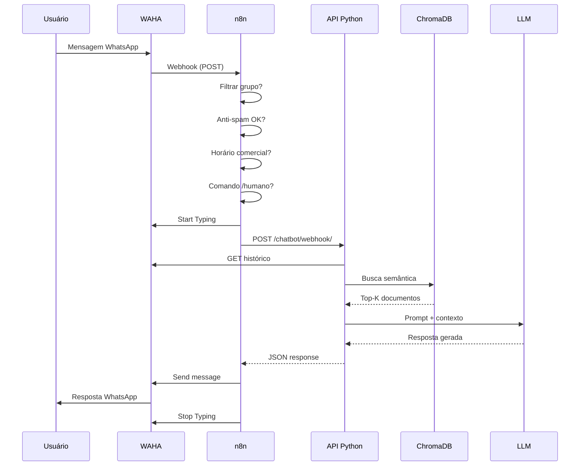

# Arquitetura do Sistema - Chatbot de Tributos

## 📐 Visão Geral

O Chatbot de Tributos é um sistema distribuído baseado em microsserviços que utiliza **RAG (Retrieval-Augmented Generation)** para fornecer respostas precisas sobre tributos municipais via WhatsApp.

```
┌─────────────┐     ┌──────┐     ┌─────────────┐     ┌──────────────┐
│  WhatsApp   │────▶│ WAHA │────▶│     n8n     │────▶│  API Python  │
│   (User)    │◀────│      │◀────│ (orquestra) │◀────│  (RAG+LLM)   │
└─────────────┘     └──────┘     └─────────────┘     └──────────────┘
                                         │                    │
                                         ▼                    ▼
                                  ┌─────────────┐    ┌──────────────┐
                                  │   Logs &    │    │  ChromaDB    │
                                  │  Analytics  │    │  (Vectors)   │
                                  └─────────────┘    └──────────────┘
```

## 🏗️ Componentes

### 1. WAHA (WhatsApp HTTP API)
**Responsabilidade**: Interface com WhatsApp

- **Porta**: 3000
- **Tecnologia**: Node.js (devlikeapro/waha)
- **Funções**:
  - Conexão com WhatsApp Web
  - Envio/recebimento de mensagens
  - Typing indicators
  - Histórico de conversas
  - Webhook para eventos

**Endpoints Principais**:
```
GET  /api/sessions              # Listar sessões
POST /api/{session}/start       # Iniciar sessão
POST /api/{session}/stop        # Parar sessão
POST /api/sendText              # Enviar mensagem
GET  /api/{session}/chats/{id}  # Histórico
```

### 2. n8n (Workflow Automation)
**Responsabilidade**: Orquestração e regras de negócio

- **Porta**: 5679
- **Tecnologia**: Node.js (n8nio/n8n)
- **Funções**:
  - Filtrar mensagens de grupos
  - Anti-spam (throttling)
  - Controle de horário comercial
  - Comandos rápidos (`/humano`, `/bot`)
  - Handoff para atendimento humano
  - Logging estruturado
  - Roteamento de menus

**Workflows**:
- `chatbot_completo_orquestracao.json`: Workflow principal com todas as regras
- `chatbot_orquestracao_plus_menu.json`: Workflow com engine de menus avançado

### 3. API Python (RAG + LLM)
**Responsabilidade**: Inteligência artificial e processamento

- **Porta**: 5000
- **Tecnologia**: Python 3.11, Flask
- **Funções**:
  - RAG (Retrieval-Augmented Generation)
  - Consulta à base vetorial (ChromaDB)
  - Geração de respostas via LLM
  - Gerenciamento de contexto/histórico
  - Menu interativo de links

**Arquitetura Interna**:
```
app.py (Flask)
├── bot/
│   ├── ai_bot.py           # RAG + LLM
│   └── link_router.py      # Menus
├── services/
│   ├── config.py           # Configuração
│   ├── waha.py            # Cliente WAHA
│   ├── logging_setup.py   # Logs
│   └── structured_logging.py
└── rag/
    ├── load_knowledge.py  # Carregamento de docs
    └── data/              # Base de conhecimento
```

### 4. ChromaDB (Vector Database)
**Responsabilidade**: Armazenamento de embeddings

- **Tecnologia**: ChromaDB (embedded)
- **Volume**: `chroma_data/`
- **Funções**:
  - Armazenar embeddings de documentos
  - Busca semântica vetorial
  - Persistência de conhecimento

**Modelo de Embedding**: `sentence-transformers/all-MiniLM-L6-v2`

## 🔄 Fluxo de Dados

### Mensagem do Usuário → Resposta



## 🎛️ Configuração por Ambiente

### Variáveis de Ambiente Críticas

```env
# LLM
LLM_PROVIDER=groq              # groq, openai, xai
LLM_MODEL=llama-3.3-70b-versatile
GROQ_API_KEY=gsk_xxx

# WAHA
WAHA_API_URL=http://waha:3000
WAHA_API_KEY=tributos_nova_trento_2025_api_key_fixed
WAHA_SESSION=default

# App
PORT=5000
ENVIRONMENT=production
DEBUG=false
LOG_LEVEL=INFO

# RAG
CHROMA_PATH=./chroma_data
KNOWLEDGE_PATH=./rag/data
RAG_TOP_K=5
RAG_RELEVANCE_THRESHOLD=0.3

# n8n
THROTTLE_MAX_PER_MIN=6
THROTTLE_WINDOW_SEC=60
HOURS_START=07:00
HOURS_END=13:00
WORKDAYS=1,2,3,4,5
HANDOFF_MODE=auto
```

## 📦 Deploy

### Docker Compose (Recomendado)

```bash
# 1. Configurar ambiente
cp .env.example .env
# Editar .env com credenciais

# 2. Iniciar stack completa
docker-compose up -d

# 3. Carregar base de conhecimento
docker-compose exec api python rag/load_knowledge.py

# 4. Configurar n8n
# Acesse http://localhost:5679
# Importe workflow de n8n/workflows/

# 5. Conectar WhatsApp
# Acesse http://localhost:3000
# Login: admin / Tributos@NovaTrento2025
# Conecte sessão via QR Code
```

### Kubernetes (Produção)

```yaml
# Exemplo de deployment
apiVersion: apps/v1
kind: Deployment
metadata:
  name: chatbot-api
spec:
  replicas: 2
  selector:
    matchLabels:
      app: chatbot-api
  template:
    metadata:
      labels:
        app: chatbot-api
    spec:
      containers:
      - name: api
        image: ghcr.io/arturmelo2/chatbot-tributos:latest
        ports:
        - containerPort: 5000
        env:
        - name: LLM_PROVIDER
          value: "groq"
        volumeMounts:
        - name: chroma-data
          mountPath: /app/chroma_data
      volumes:
      - name: chroma-data
        persistentVolumeClaim:
          claimName: chroma-pvc
```

## 🔒 Segurança

### Práticas Implementadas

1. **Autenticação**:
   - WAHA: API Key fixa (`WAHA_API_KEY`)
   - n8n: Webhook com ID único
   - API: Validação de payload

2. **Dados Sensíveis**:
   - `.env` nunca versionado
   - API keys em variáveis de ambiente
   - Logs sem informações pessoais (mascaramento)

3. **Network Isolation**:
   - Rede Docker privada (`tributos_network`)
   - Apenas portas necessárias expostas
   - Comunicação interna via DNS

4. **Rate Limiting**:
   - Anti-spam no n8n (6 msgs/min por padrão)
   - Timeout em requisições LLM (30s)

### Checklist de Segurança

- [ ] Alterar `WAHA_DASHBOARD_PASSWORD`
- [ ] Configurar firewall (permitir apenas portas 3000, 5000, 5679)
- [ ] Habilitar HTTPS (reverse proxy com nginx/traefik)
- [ ] Backup regular de `chroma_data/` e `n8n_data/`
- [ ] Monitoramento de logs para atividades suspeitas
- [ ] Rotação de API keys a cada 90 dias

## 📊 Monitoramento

### Logs Estruturados

Todos os logs são em JSON:

```json
{
  "timestamp": "2025-11-04T12:34:56Z",
  "level": "INFO",
  "logger": "app",
  "message": "Nova mensagem processada",
  "chat_id": "5511999999999@c.us",
  "response_time": 1.234
}
```

**Locais**:
- API: `logs/app.log`
- n8n: Dashboard web + workflow logs
- WAHA: Container logs

### Health Checks

```bash
# API
curl http://localhost:5000/health

# WAHA
curl http://localhost:3000/api/sessions

# n8n
curl http://localhost:5679/healthz
```

### Métricas Recomendadas

- Taxa de resposta (response_time)
- Mensagens processadas/hora
- Taxa de erro (5xx)
- Uso de ChromaDB (consultas/s)
- Handoffs para humano (%)

## 🚀 Escalabilidade

### Pontos de Escala

1. **API Python**: Horizontal
   - Adicione réplicas no Docker Compose
   - Load balancer (nginx/traefik)
   - Cada réplica acessa ChromaDB shared

2. **ChromaDB**: Vertical
   - Aumentar recursos (CPU/RAM)
   - Considerar Qdrant/Weaviate para cluster

3. **n8n**: Vertical
   - Queue mode para alta carga
   - Redis para state compartilhado

4. **WAHA**: Horizontal
   - Múltiplas sessões em containers separados
   - 1 WAHA por número de telefone

### Limites Atuais

- **WAHA**: ~10 msg/s por sessão
- **API**: ~50 req/s (1 réplica)
- **ChromaDB**: ~100k documentos embedded
- **LLM**: Limitado por quota da API (Groq/OpenAI)

## 📈 Roadmap de Melhorias

### Curto Prazo (1-2 meses)
- [ ] Dashboard de métricas (Grafana)
- [ ] Backup automático (cron)
- [ ] Testes E2E automatizados

### Médio Prazo (3-6 meses)
- [ ] Multi-tenancy (várias prefeituras)
- [ ] Análise de sentimento
- [ ] Relatórios de atendimento

### Longo Prazo (6-12 meses)
- [ ] App mobile para gestores
- [ ] IA para classificação de urgência
- [ ] Integração com sistemas municipais

## 📞 Suporte

- **Issues**: https://github.com/arturmelo2/chatbot-tributos/issues
- **Email**: ti@novatrento.sc.gov.br
- **Documentação**: `/docs` folder

---

**Última atualização**: Novembro 2025  
**Versão**: 1.0.0
