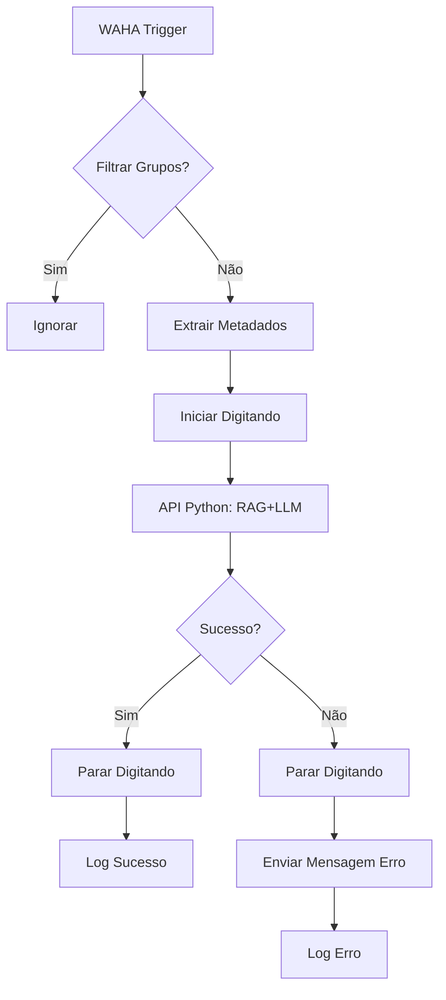

# 🤖 Chatbot Completo com Orquestração n8n

**Arquitetura:** WhatsApp → WAHA → n8n (orquestração) → API Python (RAG+LLM) → n8n → WAHA

Este guia mostra como usar n8n como **orquestrador** do chatbot, mantendo a API Python para processamento RAG/LLM.

---

## 🎯 Arquitetura

### ✅ Arquitetura Completa
```
WhatsApp → WAHA → n8n → Orquestração:
                          ├─ Filtros (grupos, comandos)
                          ├─ Controle de typing (digitando...)
                          ├─ API Python:
                          │   ├─ Histórico WAHA
                          │   ├─ RAG (ChromaDB)
                          │   └─ LLM (Groq/OpenAI)
                          ├─ Tratamento de erros
                          └─ Logging e monitoramento
```

### 📊 Responsabilidades

| Componente | Responsabilidade |
|------------|------------------|
| **WAHA** | Conexão WhatsApp, receber/enviar mensagens |
| **n8n** | Orquestração do fluxo, filtros, typing, erro handling |
| **API Python** | RAG (LangChain + ChromaDB), LLM (Groq/OpenAI), Histórico |

### 💡 Por que esta arquitetura?

✅ **n8n**: Interface visual, fácil debug, controle de fluxo  
✅ **Python**: RAG complexo, LangChain, embeddings, ChromaDB  
✅ **Separação de responsabilidades**: Cada componente faz o que faz de melhor  
✅ **Escalável**: Fácil adicionar nodes (fallback, validações, integrações)  

---

## 🚀 Instalação

### 1. Iniciar Stack Completa

```bash
# Iniciar WAHA + n8n + API Python
./scripts/up-n8n.ps1

# Aguardar containers iniciarem
# Verificar status
docker compose ps
```

### 2. Carregar Base de Conhecimento

```bash
# Popular ChromaDB com documentos
./scripts/load-knowledge.ps1
```

### 3. Configurar n8n

Acesse: http://localhost:5679

**Primeira Execução:**
1. Criar conta de administrador
2. Definir email e senha

**Instalar Community Nodes:**
- Settings → Community Nodes → Install
- Instalar: `n8n-nodes-waha`
- Reiniciar n8n: `docker restart tributos_n8n`

### 4. Configurar Credenciais n8n

**WAHA Header Auth:**
1. Credentials → Add Credential
2. Tipo: **Header Auth**
3. Name: `X-Api-Key`
4. Value: `tributos_nova_trento_2025_api_key_fixed`
5. Salvar como "WAHA API"

---

## 📋 Importar Workflow

### Workflow Principal: `chatbot_completo_orquestracao.json`

1. n8n → Workflows → Import from File
2. Selecione: `n8n/workflows/chatbot_completo_orquestracao.json`
3. O workflow será importado com todos os nodes

### Estrutura do Workflow



### Nodes Detalhados

1. **WAHA Trigger**
   - Tipo: `n8n-nodes-waha.wahaTrigger`
   - Path: `8c0ac011-c46c-4c2c-bab1-ac5e0c3a365b/waha`
   - Recebe eventos do WAHA

2. **Filtrar Grupos**
   - Tipo: `IF`
   - Condição: `$json.payload.from` contains `@g.us`
   - True → Ignorar | False → Continuar

3. **Extrair Metadados**
   - Tipo: `Set`
   - Extrai: chat_id, message, timestamp
   - Para logging e debugging

4. **Iniciar Digitando**
   - Tipo: `HTTP Request`
   - URL: `http://waha:3000/api/startTyping`
   - Mostra "digitando..." no WhatsApp

5. **Processar na API Python**
   - Tipo: `HTTP Request`
   - URL: `http://api:5000/chatbot/webhook/`
   - Method: POST
   - Body: `{{ $json }}` (payload completo)
   - Timeout: 60s (processamento RAG pode demorar)

6. **Verificar Resposta**
   - Tipo: `IF`
   - Condição: `$statusCode == 200`
   - True → Sucesso | False → Erro

7. **Parar Digitando (Sucesso/Erro)**
   - Tipo: `HTTP Request`
   - URL: `http://waha:3000/api/stopTyping`
   - Garante que indicador seja removido

8. **Enviar Mensagem de Erro** (caso API falhe)
   - Tipo: `HTTP Request`
   - URL: `http://waha:3000/api/sendText`
   - Mensagem amigável para o usuário

9. **Log Sucesso/Erro**
   - Tipo: `Code`
   - JavaScript para console.log
   - Aparece em Executions do n8n

---

## ⚙️ Configuração da API Python

A API Python já está configurada no `compose.yml` e `app.py`.

### Endpoint Principal

**POST** `http://api:5000/chatbot/webhook/`

**Payload:**
```json
{
  "event": "message",
  "payload": {
    "from": "5511999999999@c.us",
    "body": "Qual o valor do IPTU?",
    "fromMe": false
  }
}
```

**Resposta:**
```json
{
  "status": "success"
}
```

A API já:
- ✅ Busca histórico do WAHA
- ✅ Consulta ChromaDB (RAG)
- ✅ Processa com LLM (Groq/OpenAI)
- ✅ Envia resposta diretamente para WAHA
- ✅ Controla typing internamente (start/stop)

### Diferença para Orquestração n8n

**Antes (API faz tudo):**
- API Python: recebe webhook → busca histórico → RAG → LLM → envia resposta
- n8n: apenas repassa webhook

**Agora (n8n orquestra):**
- n8n: recebe webhook → filtros → typing → chama API → tratamento erro → logging
- API Python: recebe requisição → RAG → LLM → retorna

**Vantagens:**
- ✅ Controle visual do fluxo no n8n
- ✅ Fácil adicionar steps (validações, fallbacks, integrações)
- ✅ Logs e debug centralizados
- ✅ API Python focada apenas em IA (single responsibility)

---

## 🧪 Testes

### 1. Testar API Python Diretamente

```bash
# Via PowerShell
$payload = @{
    event = "message"
    payload = @{
        from = "5511999999999@c.us"
        body = "Qual o valor do IPTU?"
        fromMe = $false
    }
} | ConvertTo-Json -Depth 10

Invoke-RestMethod -Uri "http://localhost:5000/chatbot/webhook/" `
    -Method POST `
    -ContentType "application/json" `
    -Body $payload
```

### 2. Testar Workflow no n8n

1. n8n → Workflows → Abrir "Chatbot Tributos - Fluxo Completo"
2. Click em **Execute Workflow**
3. Enviar dados de teste (o n8n preenche automaticamente)
4. Ver execução completa com todos os steps

### 3. Testar via WhatsApp Real

1. Conectar WhatsApp no WAHA (se ainda não conectou):
   ```bash
   ./scripts/start-waha-session.ps1
   ```

2. Enviar mensagem pelo WhatsApp

3. Acompanhar no n8n:
   - Executions → Ver execução em tempo real
   - Cada node mostra input/output

4. Verificar logs:
   ```bash
   # Logs do n8n
   docker compose logs -f n8n
   
   # Logs da API
   docker compose logs -f api
   ```

---

## 📊 Monitoramento

### n8n Executions

- Acesse: http://localhost:5679 → Executions
- Ver todas as execuções (sucesso/falha)
- Click para ver detalhes de cada node
- Tempo de execução de cada step

### Logs Estruturados API

Logs em JSON no console da API:

```json
{
  "timestamp": "2025-11-04T12:34:56Z",
  "level": "INFO",
  "message": "✅ Resposta enviada para 5511999999999@c.us em 2.34s",
  "chat_id": "5511999999999@c.us",
  "response_time": 2.34
}
```

Ver logs:
```bash
docker compose logs -f api | Select-String "WEBHOOK PAYLOAD|Resposta enviada|Erro"
```

---

## 🔧 Personalizar Workflow

### Adicionar Validações

Adicione um node **IF** após "Filtrar Grupos":

```javascript
// Exemplo: Validar mensagens muito curtas
if ($json.payload.body.length < 3) {
  return false; // Ignora
}
return true; // Continua
```

### Adicionar Fallback para Erros

Após "Enviar Mensagem de Erro", adicione:

- **HTTP Request** para notificar admin
- **Send Email** com detalhes do erro
- **Webhook** para sistema de tickets

### Integrar com Outros Sistemas

Adicione nodes:
- **Google Sheets**: Registrar conversas
- **Airtable**: Base de dados de atendimentos
- **Slack**: Notificações para equipe
- **MySQL**: Armazenar histórico completo

---

## 🚨 Troubleshooting

### Workflow não recebe mensagens

1. Verificar se workflow está **ATIVO** (botão Active)
2. Verificar webhook URL no WAHA:
   ```
   http://n8n:5678/webhook/8c0ac011-c46c-4c2c-bab1-ac5e0c3a365b/waha
   ```
3. Ver logs WAHA:
   ```bash
   docker compose logs waha | Select-String "webhook"
   ```

### API retorna erro 500

1. Ver logs da API:
   ```bash
   docker compose logs api | Select-String "ERROR|Exception"
   ```

2. Verificar se ChromaDB está populado:
   ```bash
   ./scripts/load-knowledge.ps1
   ```

3. Verificar variáveis de ambiente (.env):
   - `GROQ_API_KEY` ou `OPENAI_API_KEY`
   - `LLM_PROVIDER=groq` ou `openai`

### Typing não aparece no WhatsApp

- Normal se WAHA não tiver autenticação configurada
- Não é crítico, apenas cosmético
- Para habilitar: configure `WAHA_API_KEY` corretamente

### Mensagens duplicadas

- Verifique se há múltiplos workflows ativos
- Desative workflows antigos
- Mantenha apenas "Chatbot Tributos - Fluxo Completo"

---

## 📈 Melhorias Futuras

### 1. Cache de Respostas

Adicionar node **Redis** antes da API para cachear perguntas frequentes.

### 2. Análise de Sentimento

Adicionar node de análise de sentimento para priorizar atendimentos negativos.

### 3. Menu Interativo

Adicionar node **Switch** para detectar comandos:
- `/menu` → Lista de opções
- `/iptu` → Informações IPTU
- `/certidao` → Links certidões

### 4. Horário de Atendimento

Adicionar node **IF** para verificar horário comercial e enviar mensagem automática fora do expediente.

### 5. Transfer para Humano

Detectar casos complexos e criar ticket para atendimento humano.

---

## ✅ Checklist Completo

- [ ] Docker containers rodando (waha + n8n + api)
- [ ] Base de conhecimento carregada (ChromaDB)
- [ ] n8n community node instalado (n8n-nodes-waha)
- [ ] Credencial WAHA configurada no n8n
- [ ] Workflow importado e ativo
- [ ] WhatsApp conectado no WAHA
- [ ] Teste via API executado com sucesso
- [ ] Teste via n8n executado com sucesso
- [ ] Teste via WhatsApp real funcionando
- [ ] Logs monitorados

---

## 📚 Arquivos Importantes

- `n8n/workflows/chatbot_completo_orquestracao.json` - Workflow principal
- `app.py` - API Python (webhook endpoint)
- `bot/ai_bot.py` - Lógica RAG + LLM
- `services/waha.py` - Cliente WAHA
- `compose.yml` - Configuração Docker
- `.env` - Variáveis de ambiente

---

**Resultado:** Chatbot completo com orquestração visual e processamento IA! 🎉

