# 🤖 Chatbot Completo em n8n

**Arquitetura:** WAHA → n8n (processamento completo) → WAHA (resposta)

Este guia mostra como usar n8n como orquestrador completo do chatbot, sem dependência da API Flask Python.

---

## 🎯 Arquitetura

### ✅ Nova Arquitetura (n8n Completo)
```
WhatsApp → WAHA → n8n → Processamento:
                          ├─ Filtros (grupos, comandos)
                          ├─ Histórico de conversa
                          ├─ RAG (ChromaDB/Pinecone)
                          ├─ LLM (Groq/OpenAI)
                          └─ Resposta via WAHA
```

### 📊 Comparação

| Componente | Arquitetura Antiga | Arquitetura Nova |
|------------|-------------------|------------------|
| **Webhook** | n8n → Python API | n8n (completo) |
| **RAG** | Python (LangChain + ChromaDB) | n8n (Vector Store nodes) |
| **LLM** | Python (Groq/OpenAI SDK) | n8n (AI nodes nativos) |
| **Histórico** | Python (WAHA client) | n8n (HTTP Request) |
| **Resposta** | Python → WAHA | n8n → WAHA |
| **Containers** | 3 (waha, n8n, api) | 2 (waha, n8n) |

---

## 🚀 Instalação

### 1. Docker Compose Simplificado

O `compose.yml` já está configurado. Para usar apenas n8n:

```bash
# Iniciar apenas WAHA e n8n
docker compose up -d waha n8n

# Verificar
docker compose ps
```

### 2. Configurar n8n

Acesse: http://localhost:5679

**Credenciais Padrão:**
- Email: admin@tributos.sc.gov.br
- Senha: Tributos@2025

### 3. Instalar Pacotes n8n Necessários

No n8n, vá em **Settings → Community Nodes** e instale:

- `@n8n/n8n-nodes-langchain` (RAG e Vector Stores)
- `n8n-nodes-waha` (integração WAHA oficial)

Reinicie o n8n após instalar:
```bash
docker restart tributos_n8n
```

---

## 📋 Workflow Completo

### Estrutura do Workflow

```mermaid
graph LR
    A[WAHA Trigger] --> B{Filtrar}
    B -->|Grupo| C[Ignorar]
    B -->|Usuário| D[Buscar Histórico]
    D --> E[RAG: Buscar Docs]
    E --> F[Montar Prompt]
    F --> G[LLM: Groq/OpenAI]
    G --> H[Enviar Resposta]
    H --> I[WAHA Send Text]
```



### Nodes do Workflow

1. **WAHA Trigger** - Recebe mensagens
   - Webhook ID: `8c0ac011-c46c-4c2c-bab1-ac5e0c3a365b`
   - Events: `message`, `session.status`

2. **Filter: Ignorar Grupos**
   - Condição: `{{ $json.payload.from.includes('@g.us') }}`
   - Se true → Stop and Error

3. **HTTP Request: Buscar Histórico**
   - URL: `http://waha:3000/api/default/chats/{{ $json.payload.from }}/messages?limit=10`
   - Headers: `X-Api-Key: tributos_nova_trento_2025_api_key_fixed`
   - Method: GET

4. **Code: Formatar Histórico**
   ```javascript
   const messages = $input.first().json.messages || [];
   const history = messages.map(m => ({
     role: m.fromMe ? 'assistant' : 'user',
     content: m.body || m.text || ''
   })).filter(m => m.content);
   
   return [{ json: { history } }];
   ```

5. **Vector Store: ChromaDB** (ou Pinecone)
   - Operation: Retrieve Documents
   - Collection: `tributos_knowledge`
   - Query: `{{ $json.payload.body }}`
   - Top K: 3

6. **Code: Montar Contexto RAG**
   ```javascript
   const question = $('WAHA Trigger').first().json.payload.body;
   const history = $('Code: Formatar Histórico').first().json.history;
   const docs = $input.first().json;
   
   const context = docs.map(d => d.pageContent).join('\n\n');
   
   return [{
     json: {
       question,
       history,
       context
     }
   }];
   ```

7. **AI: Chat Model (Groq/OpenAI)**
   - Model: `llama-3.3-70b-versatile` (Groq) ou `gpt-4o-mini` (OpenAI)
   - System Message:
   ```
   Você é um assistente virtual da Prefeitura de Nova Trento/SC.
   Responda perguntas sobre tributos municipais usando o contexto fornecido.
   Seja educado, claro e objetivo.
   
   CONTEXTO:
   {{ $json.context }}
   ```
   - Messages: `{{ $json.history }}` + User: `{{ $json.question }}`

8. **HTTP Request: Enviar Resposta**
   - URL: `http://waha:3000/api/sendText`
   - Method: POST
   - Body:
   ```json
   {
     "session": "default",
     "chatId": "{{ $('WAHA Trigger').first().json.payload.from }}",
     "text": "{{ $json.choices[0].message.content }}"
   }
   ```

---

## 🔧 Configuração de Credenciais

### Groq API
1. Settings → Credentials → Add Credential
2. Tipo: **Groq API**
3. API Key: `gsk_...` (da sua conta Groq)

### OpenAI API (alternativa)
1. Settings → Credentials → Add Credential
2. Tipo: **OpenAI API**
3. API Key: `sk-...`

### WAHA API
1. Settings → Credentials → Add Credential
2. Tipo: **Header Auth**
3. Name: `X-Api-Key`
4. Value: `tributos_nova_trento_2025_api_key_fixed`

### ChromaDB (opcional - se usar vector store)
1. Settings → Credentials → Add Credential
2. Tipo: **ChromaDB**
3. URL: `http://chromadb:8000` (se adicionar container)

---

## 📦 Docker Compose Atualizado

Se quiser usar ChromaDB como vector store separado:

```yaml
services:
  # ... (waha e n8n existentes)
  
  chromadb:
    image: chromadb/chroma:latest
    container_name: tributos_chromadb
    restart: unless-stopped
    ports:
      - '8000:8000'
    volumes:
      - chroma_data:/chroma/chroma
    networks:
      - tributos_network
    environment:
      - CHROMA_SERVER_AUTH_PROVIDER=token
      - CHROMA_SERVER_AUTH_TOKEN=tributos_chroma_token_2025
```

---

## 🧪 Testes

### 1. Testar Workflow no n8n

1. Abra o workflow
2. Click em **Execute Workflow**
3. Use dados de teste:
```json
{
  "event": "message",
  "payload": {
    "from": "5511999999999@c.us",
    "body": "Qual o valor do IPTU?",
    "fromMe": false
  }
}
```

### 2. Testar via WhatsApp Real

1. Envie mensagem para o número conectado no WAHA
2. Veja execução em **Executions** no n8n
3. Verifique resposta no WhatsApp

---

## 📊 Vantagens da Arquitetura n8n

✅ **Menos containers** - 2 em vez de 3  
✅ **Interface visual** - Facilita debug e modificações  
✅ **Sem código Python** - Tudo em low-code  
✅ **Escalável** - Fácil adicionar novos nodes  
✅ **Versionamento** - Workflows exportáveis em JSON  
✅ **Monitoramento** - Executions built-in  

---

## 🔄 Migração da API Python (Opcional)

Se quiser manter a API Python para casos específicos:

### Modo Híbrido
- **n8n**: Casos simples (perguntas diretas)
- **Python API**: Casos complexos (multi-step, validações)

Adicione um node **Switch** no workflow:
```javascript
// Redirecionar para API Python se necessário
if ($json.payload.body.includes('certidão') || $json.payload.body.includes('protocolo')) {
  return { route: 'api' };
}
return { route: 'n8n' };
```

---

## 📚 Recursos Adicionais

- [n8n AI Nodes](https://docs.n8n.io/integrations/builtin/cluster-nodes/root-nodes/n8n-nodes-langchain/)
- [WAHA Nodes](https://github.com/devlikeapro/n8n-nodes-waha)
- [ChromaDB Integration](https://docs.n8n.io/integrations/builtin/cluster-nodes/sub-nodes/n8n-nodes-langchain.vectorstorechroma/)

---

## ✅ Checklist

- [ ] Docker containers rodando (waha + n8n)
- [ ] n8n community nodes instalados
- [ ] Credenciais configuradas (Groq/OpenAI, WAHA)
- [ ] Workflow importado e ativo
- [ ] ChromaDB populado com documentos (se usar)
- [ ] Teste via n8n executado com sucesso
- [ ] Teste via WhatsApp real funcionando

---

**Resultado:** Chatbot completo funcionando 100% em n8n! 🎉
